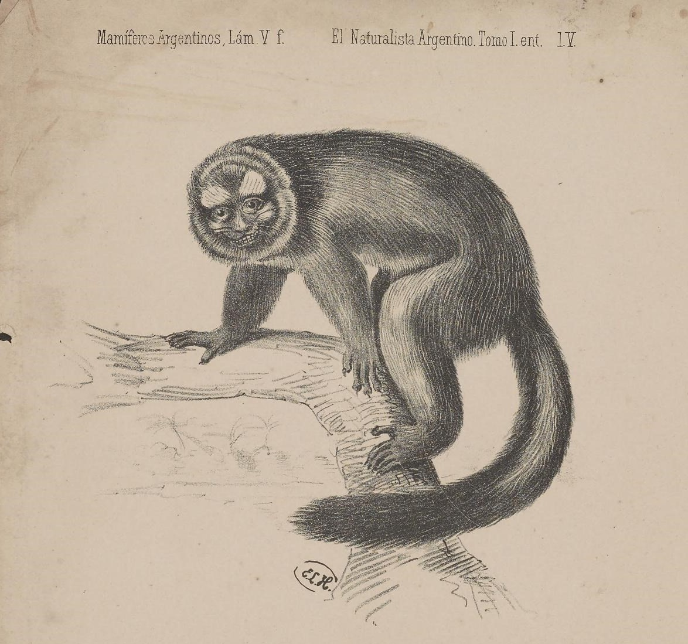

  <input id="searchbar" onkeyup="busca_entrada()" type="text"
  name="search" placeholder="Buscar...">

## ahop - jacaré

** 

Exemplo de uso:

*im kaw ara ahop (Ribeiro 2000: 53).*

você/tu come um jacaré.

## apapa - sucuri

** 

## apaxam - pica-pau

** 

## arayi\' - arara vermelha maior

** 

## awan - capivara

** 

## awi - formiga sauva

** 

## awiram - guariba

** 

## erim - jacamim

** 

## eye\' - calango

** 

## imari - veado

** 

## ime - nambú

** 

## ime unaran - nambu galinha

** 

## imi - anta/tapir

** 

## inaw - morcego

** 

## ipan - falcão

** 

## ipik - tamanduá mambira

** 

## ipikipan - tatu canastra

** 

## irawu - formiga

** 

## iwi - tucano

** 

## iwiri - marimbondo (esp.)

** 

## ixikin - traíra

** 

## ixumin - bicho preguiça

** 

## kahota - quati; cão moleiro

** 

## karakaw - cobra

** 

Exemplo de uso:

*mom irakan na karakaw (Ribeiro 2000: 11).*

as cobras.

## karapakak - peixe arraia

** 

## karatik - cobra bico de jaca

** 

## kinam - onça pintada

** 

Exemplo de uso:

*kame xem mene kin kinam (Ribeiro 2000: 43).*

onça preta.

## kinam kohihina - gato maracaja

** 

## kinipitik - mucura

** 

## koki - piranha

** 

## meki - caranguejo

** 

## mikop - agouti; tipo de paca vermelha

** 

Exemplo de uso:

*maxak ata mikop (Ribeiro 2000: 31).*

eu comerei uma paca.

## miriritike\' - vagalume

** 

## miyak - queixada

** 

## moho - urubu

** 

## mohoyap - pacú (esp.)

** 

## murumakan - arara azul

** 

## namatok - rato; camundongo

** 

## niwikin - macaco da noite

** 

## nowi\' - enguia elétrica; puraqué

** 

## otiw - macaco de cheiro

** 

## papaki\' - cupim

** 

## paxiren - beija flor

** 

## pihun - jacu

** 

Exemplo de uso:

*hiri unon pihun (Ribeiro 2000: 12).*

atirar no jacu.

## pikot - tatu grande; que faz vereda

** 

## piti - mosca

** 

## piwan - aranha caranguejeira

** 

## piyaman - tamanduá

** 

## tamuruwa\' - carrapato

** 

## tapan - macaco suim

** 

## tapapat - aranha (geral)

** 

## tapitak - formiga tucandeira

** 

## tapiw - cutia

** 

## tawi - abelha (geral)

** 

Exemplo de uso:

*tawi nakon mara wiyam (Ribeiro 2000: 7).*

abelha(esp.).

## tenerere\' - borboleta

** 

## towa - tartaruga; tracajá

** 

## towaraw - papagaio

** 

## tramin - arara vermelha

** 

## trawam - surubim

** 

## tukawan - caititu

** 

Exemplo de uso:

*hwoyt wanan uway ikeren tukawan (Ribeiro 2000: 23).*

comida de carne e mandioca.

## tunururu\' - barata

** 

## ukari - tatu

** 

## ukin - escorpião

** 

## ukuku\' - cigarra

** 

## utin - mutum

** 

## waram - macaco preto

** 

## watik - macaco gogo de sola

** 

## wawan - peixe mandi (branco)

** 

## wiraw - louva a deus; bicho pau

** 

## xerapa\' - martim pescador

** 

## xiwen - veado capoeira

** 

Exemplo de uso:

*kirik unun xiwen (Ribeiro 2000: 12).*

assar (veado).

## yimun - formiga sacassaia

** 

## yowin - macaco prego

** 

Exemplo de uso:

*kerik iyana yowin (Ribeiro 2000: 16).*

macaco bonito.
