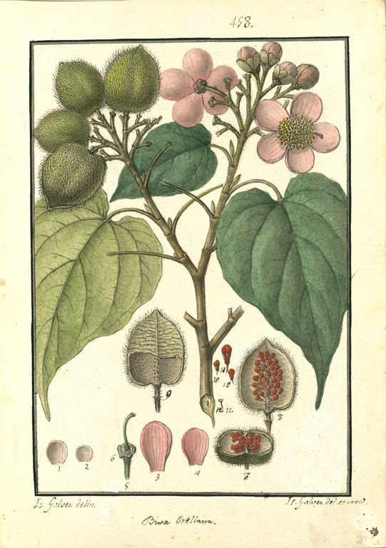

  <input id="searchbar" onkeyup="busca_entrada()" type="text"
  name="search" placeholder="Buscar...">

## ahorop - genipapo do mato

** 

## akopa - macaxeira

** 

## awine - banana (geral)

** 

## ayiwe\' - tabaco; fumo; cigarro

** 

Exemplo de uso:

*nuk ata ayiwe (Ribeiro 2000: 35).*

fumar.

## iram - açaí

** 

## kanowan - cacau

** 

## kaxin - abacaxi

** 

## mapak - milho

** 

Exemplo de uso:

*wixi kaw ata mapak (Ribeiro 2000: 12).*

assar milho.

## maran ka - jerimum

** 

## matan - cará inhame

** 

## mawin - urucum

** 

## mowa\' - timbó

** 

## panayi winu\' - caju do mato; árvore

** 

## po\'a\' - mamão

** 

## tike - castanha do Pará

** 

## trawan - patawa

** 

## tunuwakan - inajá

** 

## tupaxakam - pupunha

** 

## utimatan - batata

** 

## utu - cabaça; cuia

** 

## uwaw - tucumã

** 

## watam - fruta pama

** 

## winu\' - caju

** 

## wom - algodão; roupa

** 

Exemplo de uso:

*kite aton wom (Ribeiro 2000: 7).*

abrir o algodāo.
